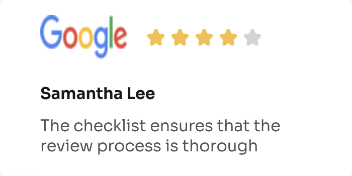
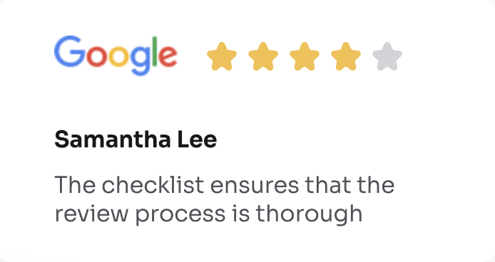

<!-- Please update value in the {}  -->

<h1 align="center">Testimonial Page | devChallenges</h1>

   Solution for a challenge <a href="https://devchallenges.io/challenge/testimonial-page" target="_blank">Testimonial Page</a> from <a href="http://devchallenges.io" target="_blank">devChallenges.io</a>.

  <h3>
    <a href="https://testimonial-page-weld.vercel.app/">
      Demo
    </a>
     | 
    <a href="https://github.com/dc-code-creations/testimonial-page">
      Solution
    </a>
     | 
    <a href="https://devchallenges.io/challenge/testimonial-page">
      Challenge
    </a>
  </h3>

<!-- TABLE OF CONTENTS -->

## Table of Contents

- [Overview](#overview)
  - [What I learned](#what-i-learned)
  - [Useful resources](#useful-resources)
- [Built with](#built-with)
- [Features](#features)
- [Contact](#contact)
- [Acknowledgements](#acknowledgements)

<!-- OVERVIEW -->

## Overview

<!--
Introduce your projects by taking a screenshot or a gif. Try to tell visitors a story about your project by answering:

- What have you learned/improved?
- Your wisdom? :)
-->

This project wasn't too bad. This was actually the quickest I've finished one of these challenges. In the past, I have gotten too caught up on the details too early in the project, so my goal this time was to finish this project as quickly as possible without focusing too much on the details. Finish what is necessary first, then focus on the details that need tweaking later. I think I did a pretty good job of that while completing this project. I spent somewhere around 6-7 hours total on this project, so that is a vast improvement from past projects. I was definitely more focused than I have been in the past. I plan to keep this focused energy up for future projects so that I can get to the point of better predicting how long a project will take me to complete.

### What I learned

<!-- Use this section to recap over some of your major learnings while working through this project. Writing these out and providing code samples of areas you want to highlight is a great way to reinforce your own knowledge. -->

- I tried to make the star rating section smaller by adding some padding to the top and bottom of the section, however when I did this, it would warp the company logo, too. Ultimately, I decided to add an equal amount of padding to the top and bottom of the company logo as well, and that seems to have resolved the issue. I am not sure whether this is the best way to do it or not, but it works well enough for what I need it to do.

### Useful resources

<!--
- [Example resource 1](https://www.example.com) - This helped me for XYZ reason. I really liked this pattern and will use it going forward.
- [Example resource 2](https://www.example.com) - This is an amazing article which helped me finally understand XYZ. I'd recommend it to anyone still learning this concept.
-->

- [list-style misalignment issue](https://www.sitepoint.com/community/t/css-list-style-image-vertical-alignment-issue/5242) - When alter the list style for the unordered list, I found that the bullet points were no longer aligned with the text. This post (as well as this one [second list-style post](https://stackoverflow.com/questions/14709538/aligning-list-style-image-proportionally-with-text)) helped me figure out how to get the bullet point decorations to be aligned with the text

- warped logo vs unwarped logo

  - adding top and bottom padding to just the star rating section ended up warping the logo on the review. To solve this, I added an identical amount of padding to the top and bottom of the logo as well to avoid warping the logo

### Built with

<!-- This section should list any major frameworks that you built your project using. Here are a few examples.-->

- Semantic HTML5 markup
- CSS custom properties
- Flexbox
- CSS Grid
- [React](https://reactjs.org/)
- [Vue.js](https://vuejs.org/)
- [Tailwind](https://tailwindcss.com/)

## Features

<!-- List the features of your application or follow the template. Don't share the figma file here :) -->

This application/site was created as a submission to a [DevChallenges](https://devchallenges.io/challenges-dashboard) challenge.

## Acknowledgements

<!-- This section should list any articles or add-ons/plugins that helps you to complete the project. This is optional but it will help you in the future. For exmpale -->

## Author

- Website [your-website.com](https://daracline.gitlab.io/)
- GitHub [@your-username](https://github.com/dc-code-creations/testimonial-page)
